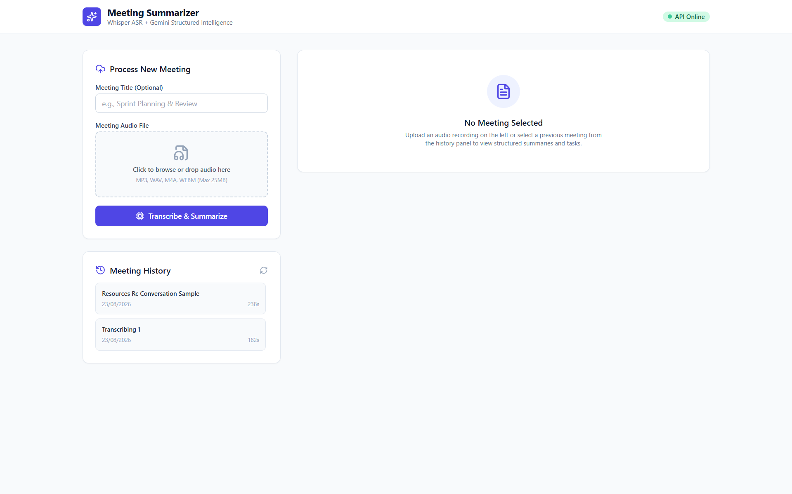
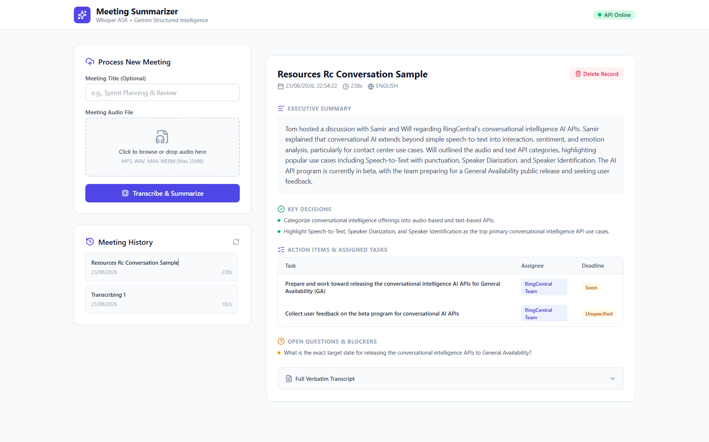

# Meeting Intelligence Summarizer

An enterprise-ready meeting transcription and action-oriented intelligence engine. Built following **SOLID principles**, **Domain-Driven Design (DDD)**, and Clean Layered Architecture.

---

## Key Features

- **Automated Speech Recognition (ASR):** High-speed, accurate audio transcription using Whisper (`whisper-large-v3-turbo`) via Groq Cloud.
- **Structured Intelligence Extraction:** Zero-hallucination executive summaries, key decisions, assigned action items (task/owner/deadline), and open blockers using Google Gemini (`gemini-3.6-flash`) with strict Pydantic JSON schemas.
- **Relational Persistence:** SQLite repository pattern maintaining transcript history, audio metadata, and serialized intelligence entities.
- **Responsive Dashboard:** Upload audio (drag-and-drop), view real-time pipeline status, inspect structured action-item tables, and browse historical meeting records.
- **Clean Architecture & SOLID:** Modular boundaries decoupling domain rules, storage adapters, and external APIs.

---
 
## Screenshots
 
### Dashboard — No Meeting Selected
Upload panel supporting drag-and-drop audio (MP3, WAV, M4A, WEBM up to 25MB), with meeting history tracked on the left.
 

 
### Structured Meeting Intelligence Output
Once processed, each meeting record displays an executive summary, key decisions, an action items table (task / assignee / deadline), open questions & blockers, and an expandable full verbatim transcript.
 

 
---

## Architecture & SOLID Compliance

```text
meeting-summarizer/
├── app/
│   ├── core/                  # Configuration, environment, and domain exceptions
│   ├── domain/                # Enterprise business entities (models)
│   ├── interfaces/            # Abstract base classes (contracts / DIP)
│   ├── infrastructure/        # Adapters (ASR, LLM, SQLite repository)
│   ├── services/              # Use-case orchestration (MeetingService)
│   ├── api/                   # Presentation layer (Flask blueprints & middleware)
│   └── container.py           # Composition root & dependency injection
├── templates/                 # Frontend UI (Tailwind CSS)
├── static/                    # Frontend JS & asset pipeline
├── tests/                     # Unit and integration test suite
└── run.py                     # WSGI application entry point
```

### Applied SOLID Principles

| Principle | Application |
|---|---|
| **Single Responsibility (SRP)** | API routes strictly handle HTTP transport; `MeetingService` orchestrates workflows; ASR adapters handle only speech processing. |
| **Open/Closed (OCP)** | New ASR engines (e.g., Google STT, Azure Speech) or LLM models can be added by implementing interfaces without altering existing pipeline logic. |
| **Liskov Substitution (LSP)** | Any `IASRService` or `ILLMService` implementation can be swapped seamlessly in the dependency container. |
| **Interface Segregation (ISP)** | Independent abstractions: `IASRService`, `ILLMService`, `IMeetingRepository`. |
| **Dependency Inversion (DIP)** | High-level application modules depend exclusively on abstract contracts, not concrete third-party SDKs. |

---

## Quickstart Guide

### 1. Clone & Setup Environment

```bash
git clone https://github.com/<your-username>/meeting-summarizer.git
cd meeting-summarizer

python -m venv venv
source venv/bin/activate  # On Windows: venv\Scripts\activate
pip install -r requirements.txt
```

### 2. Configure Environment Variables

Create a `.env` file in the root directory:

```env
GROQ_API_KEY="gsk_..."
GEMINI_API_KEY="AIzaSy..."
FLASK_ENV="development"
PORT=5000
MAX_FILE_SIZE_MB=25
```

### 3. Run the Application

```bash
python run.py
```

Visit `http://127.0.0.1:5000/` in your browser.

### 4. Run Automated Tests

```bash
pytest -v
```

---

## REST API Reference

| Method | Endpoint | Description |
|---|---|---|
| `POST` | `/api/v1/transcribe` | Transcribe an audio file to raw text |
| `POST` | `/api/v1/meetings/process` | Full pipeline: transcribe + summarize + persist |
| `GET` | `/api/v1/meetings` | List all persisted meeting records |
| `GET` | `/api/v1/meetings/<id>` | Fetch a single meeting record by ID |
| `DELETE` | `/api/v1/meetings/<id>` | Delete a meeting record |

---

## LLM Prompt Engineering Strategy

The summarization pipeline uses a system-instruction grounding approach:

- **Pydantic Schema Enforcement:** Guarantees response structure matching `MeetingSummaryResult` without Markdown wrappers or malformed JSON.
- **Deterministic Extraction:** Sets temperature to `0.2` to eliminate hallucinations and extract only explicitly stated action items, assignees, and deadlines.
- **Fallback Defaults:** Automatically maps unmentioned owners to `"Unassigned"` and unmentioned timelines to `"Unspecified"`.

---

## Tech Stack

- **Backend:** Flask (Python), Clean/Layered Architecture with Dependency Injection
- **ASR:** Whisper (`whisper-large-v3-turbo`) via Groq Cloud
- **LLM:** Google Gemini (`gemini-3.6-flash`) with Pydantic-enforced structured output
- **Database:** SQLite (Repository Pattern)
- **Frontend:** HTML + Tailwind CSS + JavaScript
- **Testing:** Pytest

---

## License

This project is submitted as part of a placement assignment for Unthinkable Solutions.
